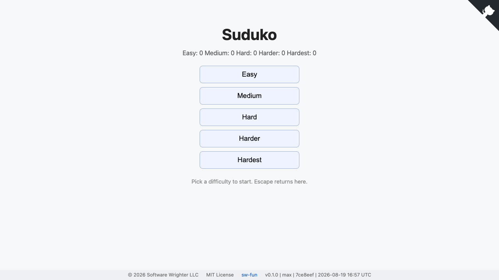
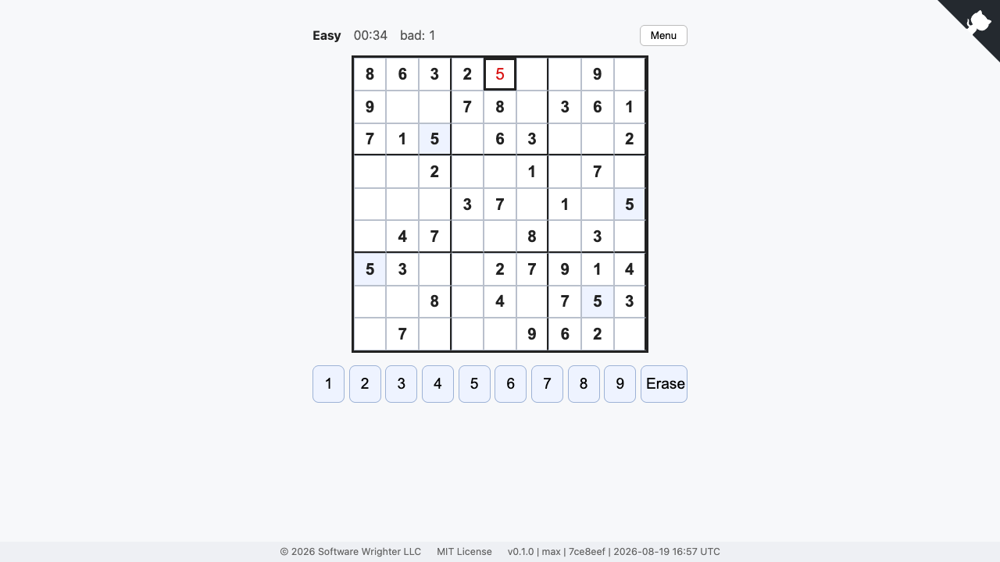
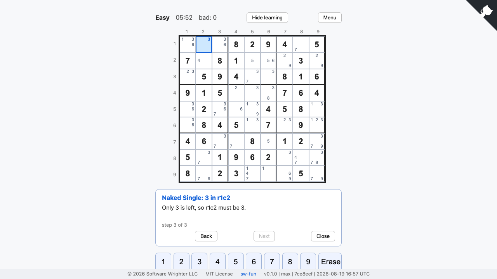

# Suduko

Browser-based Sudoku built with Rust, Yew, and WASM.

**Play the live demo:** https://sw-fun.github.io/sudoku/ (built locally by
`scripts/build-pages.sh` and pushed with `pages/`; no CI build).

Learn mode teaches solving strategies on the live board: it lists every
strategy currently applicable (singles, pointing/claiming, pairs,
X-Wing, XY-Wing) and walks each one step by step with colored,
animated highlighting - pattern cells outlined, involved rows/columns/
blocks tinted, eliminated candidates pulsing red with strike-through,
placements pulsing green. Show me mode has the game solve the board
itself, applying and explaining one strategy at a time - auto with a
speed selector (1s/3s/6s, manual Next pauses), or step-by-step; when
the taught techniques run out it explains a trial placement, so even
Hardest boards solve to the end.

Development is saga driven (AgentRail) and TDD, decomposed into top-level
component workspaces (the sw-mlpl pattern): each `components/*` directory
is its own cargo workspace with small crates, sharing one root `target/`
and a global build lock (`scripts/serial.sh`).

- `components/engine`
  - `suduko-grid` - Board/Cell model, coordinate helpers (`peers_of` =
    exactly 20 peers), 81-char serialization, `Puzzle` with fail-closed
    construction, `first_conflict` validation.
  - `suduko-solver` - deterministic backtracking (`solve`),
    `count_solutions(board, cap)` (cap 2 decides uniqueness),
    most-constrained-cell selection; solves AI Escargot under 2s.
  - `suduko-generator` - SplitMix64 `Rng` (pinned golden stream),
    `generate_full(seed)` randomized fill, `dig` removes clues only while
    uniqueness holds (optional point symmetry); structurally terminating.
  - `suduko-techniques` - `Candidates` bitmasks, `Effect`, units, singles,
    locked candidates, naked/hidden subsets.
  - `suduko-techniques-advanced` - XY-wing and basic fish (X-wing,
    swordfish).
  - `suduko-grader` - the ladder as a chain of responsibility
    (cheapest technique first), bounded-trial fallback (depth 8),
    `grade()` returning counts, hardest technique, and a hundred-wide
    score band (100-299 singles, 300-399 locked, 400-599 subsets,
    600-699 XY-wing, 700-799 fish, 800+ trial). `grade` fails fast on
    clue-inconsistent boards and does not support near-empty boards.
  - `suduko-engine` - the facade: `Level`, band config, and the
    accept/reject `generate(level, seed)` loop (fresh grids, independent
    digs, technique band plus clue window per level, fail-closed
    `LevelError::Exhausted`).
- `components/ui`
  - `suduko-ui` - Yew/WASM frontend (board rendering, input, stats,
    cookie-persisted game state; under construction).

## Commands

- `just check` - full pre-commit gate (per-workspace fmt, clippy -D
  warnings, tests; ui wasm build; markdown validation; sw-checklist).
- `just fmt` - apply canonical formatting across workspaces.
- `just build-ui` / `just serve` - trunk release build; serve with the
  Rust file server `basic-http-server -a 0.0.0.0:9501` (never Python).
- `scripts/cargo-all.sh <cmd>` - run one cargo command in every
  component workspace sequentially.

## Difficulty evidence

Seeded statistical gates (per level: band membership, uniqueness, clue
windows, strictly monotone mean scores 137 < 356 < 467 < 679 < 924) live
in `suduko-engine` tests; measured tables and methodology are in
`docs/difficulty-stats.md` and `docs/engine-acceptance.md`.

- Delivery plan: `docs/plan.md`
- Saga queue: `docs/sagas.md`
- Agent rules: `AGENTS.md`
